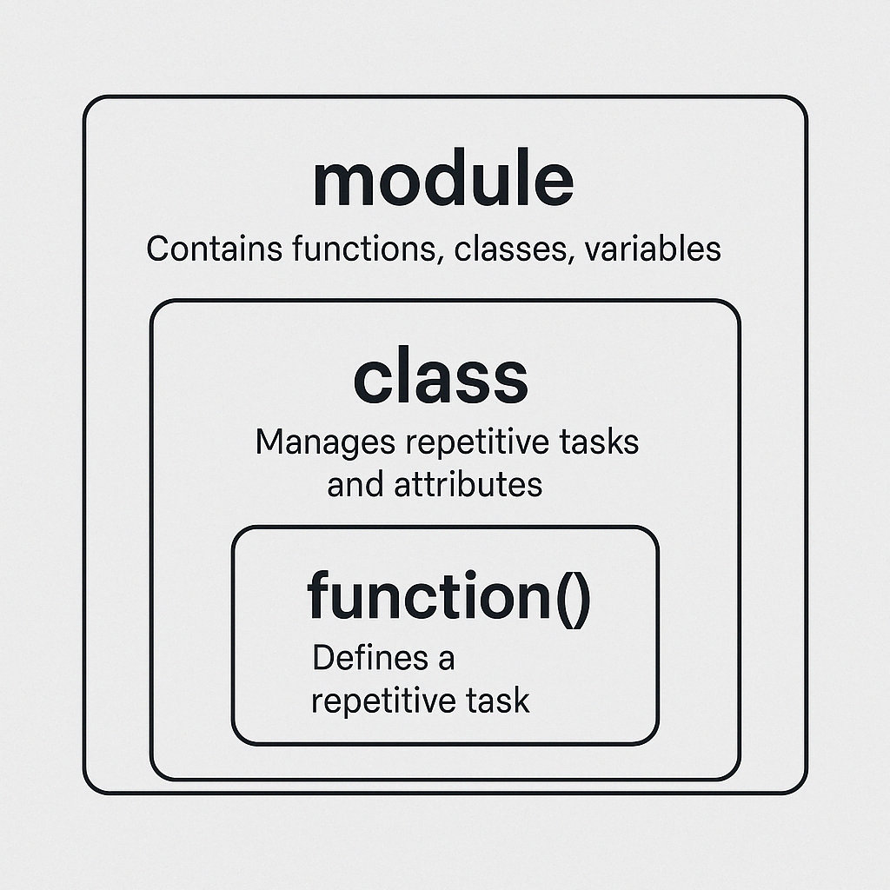

# Pseudocode
- 슈도코드는 특정 프로그래밍 언어에 종속되지 않은 고수준(high-level) 알고리즘 표현 방식
- 즉, 프로그램의 논리를 설명할 때 사용되며, 실제 코드로 변환하기 전에 프로그램의 구조를 설계하는 데 유용

## 슈도코드의 목적
- 소프트웨어를 `계획`하고 `설계`하는 도구
- 복잡한 논리를 `명확하고 간결하게 표현`
- 프로그래밍 언어에 익숙하지 않은 사람도 이해할 수 있도록 설계
- 개발자 간의 `아이디어 공유 및 소통`에 활용
- 실제 코드 작성 전에 프로그램의 `흐름을 이해`하는 데 도움

***주의할 점***
- 현업에서는 슈도코드를 거의 사용하지 않음.
- 대부분의 개발자는 특정 프로그래밍 언어로 직접 코드 작성하는 것을 선호.
- 하지만, 프로그램의 논리를 정리하거나, 코딩을 처음 배울 때는 슈도코드가 큰 도움이 될 수 있음.

## Pseudocode에서 주로 사용되는 키워드
| 키워드        | 설명                            |
|--------------|--------------------------------|
| **BEGIN / END** | 프로그램의 시작과 끝을 나타냄 |
| **IF / THEN / ELSE / ENDIF** | 조건문(분기문) |
| **WHILE / DO / ENDWHILE** | 조건이 참일 때 반복하는 while문 |
| **FOR / TO / ENDFOR** | 일정 횟수만큼 반복하는 for문 |
| **CASEWHERE / OTHERWISE / ENDCASE** | 여러 조건을 비교하는 switch문과 유사 |
| **REPEAT / UNTIL** | 조건이 참이 될 때까지 반복 (do-while) |
| **INPUT / OUTPUT** | 사용자 입력 및 출력 관련 명령 |
| **GET** | 데이터를 입력받음 (INPUT과 유사) |
| **DISPLAY** | 데이터를 출력함 (OUTPUT과 유사) |

## 예시
### 예제 1: 숫자 입력 후 출력하기
```pseudocode
BEGIN
    DISPLAY "숫자를 입력하세요: "
    GET number
    DISPLAY "입력한 숫자는 ", number
END
```
- DISPLAY: 화면에 메시지를 출력
- GET: 사용자의 입력을 받음

### 예제 2: FOR 반복문 (1부터 5까지 출력)
```pseudocode
BEGIN
    FOR i TO 5 DO
        DISPLAY i
    ENDFOR
END
```
- `FOR i TO 5`: i를 1부터 5까지 증가시키면서 반복
- `DISPLAY i`: i 값을 출력
<br/>

# Module: study_module
- 파이썬 코드가 담긴 파일, 어떤 기능들을 미리 만들어 놓은 도구 상자
- 내가 만들지 않앋도 누군가가 만든 모듈을 불러와서 사용하는 것 가능

## 모듈은 왜 사용할까?
- 코드를 재사용 할 수 있어서 편리
- 다른 사람이 만든 것 내가 활용도 가능
- 코드가 더 깔끔하고 관리하기 쉬움.

## `Module` VS `class`
| 구분	| <center>모듈 (module)</center> | <center>클래스 (class)</center>|
|------|--------------|--------------|
|뭐지?	| 파이썬 코드가 들어있는 파일 (.py) |	어떤 기능이나 데이터를 하나의 설계도처럼 묶어놓은 구조|
|목적|	관련된 함수/변수/클래스를 한 곳에 모아두기|	객체(사물)의 속성과 행동을 정의|
|사용 예시	|import math, import my_utils|	class Dog:, class Car:|
|실생활 비유|	🛠️ `도구 상자`	|🐡 붕어빵을 만드는 `설계도`|
|크기/범위	|더 큰 단위 (클래스도 포함 가능)	|모듈 안에 여러 개 있을 수 있음|

## 사용법
### 내장 모듈 사용하기
```python
import math # import라는 키워드를 사용하여 원하는 모듈을 불러옴

print(math.sqrt(16))  # 결과: 4.0
```
<sup>math는 파이썬에서 기본으로 제공하는 수학 모듈</sup>

#### 예시 1: `수학` 계산
```python
import math

print("√25 =", math.sqrt(25)) # sqrt: squire root, √25  = 5.0
print("π =", math.pi) # π = 3.141592653589793
print("2의 3제곱 =", math.pow(2, 3)) # pow: power, 2의 3제곱 = 8.0
print("절댓값의 로그10 =", math.log10(abs(-1000))) # 절댓값의 로그10 = 3.0
```

#### 예시 2: `random` 모듈 – 랜덤한 값 생성
```python
import random

print("랜덤 정수 (1~10):", random.randint(1, 10)) # rand + int (랜딧, 랜드인트)
print("랜덤 실수 (0~1):", random.random())
print("리스트에서 랜덤 선택:", random.choice(['🍎', '🍌', '🍇']))
print("리스트 섞기:")
fruits = ['apple', 'banana', 'grape']
random.shuffle(fruits)
print(fruits)
print("랜덤 샘플 2개:", random.sample(range(1, 20), 2))
```

#### 예시 3: `datetime` 모듈 – 날짜와 시간 다루기
```python
import datetime

now = datetime.datetime.now()
print("현재 날짜와 시간:", now)

print("오늘 날짜만:", now.date())
print("현재 시각만:", now.time())
print("내일은:", now + datetime.timedelta(days=1))
print("올해는 윤년일까?", datetime.datetime.now().year % 4 == 0)
```

#### 예시 4: `os` 모듈 – 시스템 기능 사용
```python
import os

print("현재 작업 디렉토리:", os.getcwd())
print("내 컴퓨터의 환경 변수 목록:", os.environ)
print("파일/폴더 리스트:", os.listdir())
print("임의의 경로 결합:", os.path.join("folder", "file.txt"))
print("폴더 존재 확인:", os.path.exists("folder"))
```

#### 예시 5: `time` 모듈 – 시간 지연 / 측정
```python
import time

print("3초 후에 인사할게요...")
time.sleep(3)
print("안녕하세요!")

start = time.time()
for i in range(1000000):
    pass
end = time.time()
print("코드 실행 시간:", end - start, "초")
```
<br/>

# `Module` VS `Class` VS `Function`
- 컴퓨터라는 건 결국 반복되는 작업을 간단하게 처리하고, 사람들이 쉽게 사용할 수 있게 만드는 도구
- 그런데 코드 양이 많아질수록 정리가 안 되면 유지보수도 어렵고, 보기 힘들어짐
- 그래서 비슷한 기능끼리 묶어서 정리하는 게 필요. 그래서 쓰는게 `Module`, `class`, `function`
<br/>
<br/>

|요소	| 역할	| 작성 위치	 | 확장성 |
|----|-------|---------|-------|
|function()	|반복 작업을 정의 (`기능 하나`)	|어떤 .py 파일 안에서도 작성 가능|	작음|
|class	|`함수`와 `변수` 묶기 (설계도 역할)	|마찬가지로 .py 파일 안에서 작성 가능|	중간|
|module	|`함수` + `클래스` + `변수`들 묶음 (파일 단위)|	자체적으로 .py 파일로 따로 작성	|큼 (파일 단위)|

<sup>- 규모로 보면 `function < class < module` 순이고,
이 셋 다 반복되는 작업을 더 잘, 더 효율적으로 관리하려고 만든 도구 </sup> <br/>
<sup>- 기능은 겹치는 부분도 있지만, 용도와 범위가 점점 더 넓어지는 구조라고 보면</sup>

<br/>

